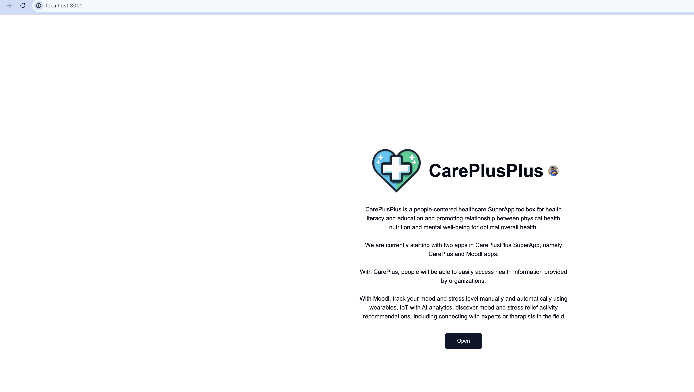
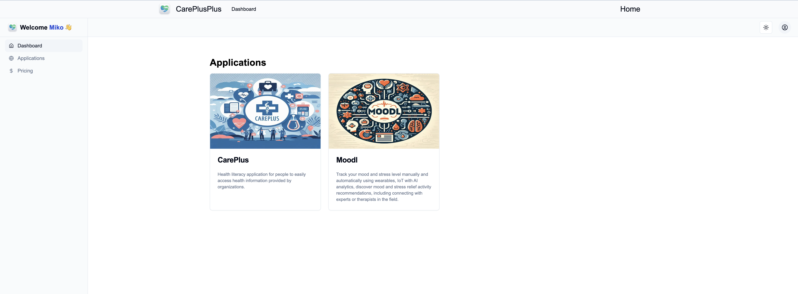
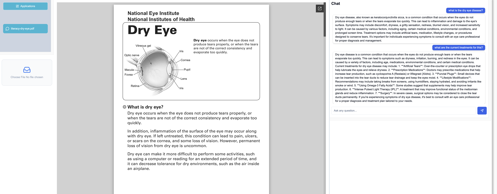

# CarePlusPlus - Generative AI Super App and Toolbox for Healthcare


CarePlusPlus is a people-centered healthcare SuperApp toolbox for health literacy and education and promoting relationship between physical health, nutrition and mental well-being for optimal overall health.

We are currently starting with two apps in CarePlusPlus SuperApp, namely CarePlus and Moodl apps.

With CarePlus, people will be able to easily access health information provided by organizations.

With Moodl, track your mood and stress level manually and automatically using wearables, IoT with AI analytics, discover mood and stress relief activity recommendations, including connecting with experts or therapists in the field

By using **OpenAI SDK**, **vector embeddings**, **Pinecone**, and **Postgres**, the chatbot knows about nutrition and dry eye information documents stored on the Amazon S3 object storage with the vector embeddings stored in Pinecone. It can retrieve relevant information to answer your questions and summarize information.

**Response streaming** is implemented via the **Vercel AI SDK**.



#### Try it!

Let's try it out! Here are some questions you could try asking:

- Hi
- What can you do?
- What are the macronutrients?
- And what do they do?
- What is the dry eye disease?
- What are the current treatments for this?

---



# Built With

Languages, frameworks, platforms, cloud services, databases, APIs, anf other technologies used:

- Next/React
- TypeScript
- Clerk
- Drizzle ORM
- Neon
- OpenAI API
- Langchain
- Pinecone and more

# Installation

Steps to install and setup the project:

1. **Clone the repository**

   Open  terminal and run the following command:

   ```bash
   git clone git@github.com:mikoaro/careplusplus.git
   ```

2. **Navigate to the project directory**

   ```bash
   cd careplusplus
   ```

3. **Install Node.js**

   The project requires Node.js. You can download it from [here](https://nodejs.org/en/download/).

4. **Install the required dependencies**

   Run the following command to install all the required dependencies:

   ```bash
   npm install
   ```

   This will install all the dependencies listed in the `package.json` file, including Next.js, React, and other specific dependencies. Flag --legacy-peer-deps may be needed for much older dependencies.

5. **Setup environment variables**

    Copy or move a `.env.template` file to the `.env` file in the root directory of your project and add the required environment variables.

6. **Run the project**

    Now, you can run the project using the following command:

    ```bash
    npm run dev
    ```

    Open [http://localhost:3000](http://localhost:3000) with your browser to see the result.

## 📈 Next steps

Feel free to extend this app in any way you like. Here are some ideas for next steps:

- Support more file formats
- Pull in documents via API
- Perform RAG on audio and video clips upload 




[Moodl-Recommendations](./screenshots/4.png)

[Leaflet-Therapists](./screenshots/5.png)